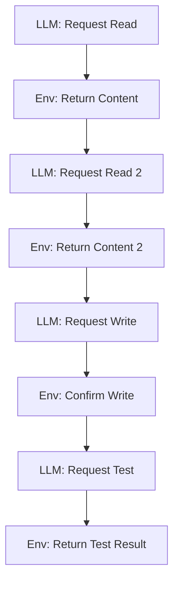
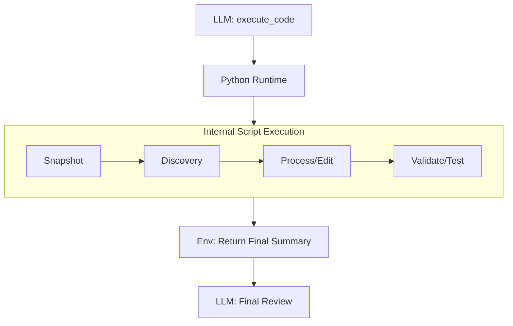

# Overview

This repository contains a set of high-efficiency system prompts and skills for code engineering or general purpose applications.

Available for `Hermes Agent` and `Kilocode` v5.12.x

## Key Advantages

- **Efficiency**: Up to 98% time & token reduction compared to traditional multiple tool call approaches. Dramatically faster end-to-end completion.
- **Batching**: Stacks all required execution in a single flow, feeding validation immediately into the next step.
- **Persistence**: Longer sessions as the context window is preserved due to fewer tool call churns.
- **Reliability**: Fewer errors as the LLM focuses on context rather than patching repetitive tool calls.

# Example

Generally, agentic harnesses provide an ergonomic toolset for operational interaction, but they typically rely on sequential tool-calling patterns that increase latency and token consumption.


### Traditional Approach vs. `atomic-ops` Example Approach

| Feature | Traditional Approach (Anti-Pattern) | `atomic-ops` Approach (Optimized) |
| :--- | :--- | :--- |
| **Tool Call Pattern** | **Sequential & Chatty**: Multiple back-and-forth turns between the LLM and the environment. | **Batched & Atomic**: A single `execute_code` call containing a comprehensive Python script. |
| **Execution Flow** | `read_file` $\rightarrow$ LLM $\rightarrow$ `read_file` $\rightarrow$ LLM $\rightarrow$ `write_file` | `execute_code` $\rightarrow$ (Python Runtime: Discovery $\rightarrow$ Process $\rightarrow$ Validate) $\rightarrow$ LLM |
| **Latency** | **High**: Each tool call incurs network latency and LLM generation time. | **Low**: Operations happen at native Python speed within a single runtime session. |
| **Context Usage** | **Inefficient**: Context window is filled with repetitive tool call/response churn. | **Efficient**: Only the final summary and critical errors are returned to the LLM. |
| **Validation** | **Reactive**: Errors are often found only after the LLM attempts the next tool call. | **Proactive**: Validation (e.g., compiler checks) is integrated into the script; the script fails fast. |
| **Reliability** | Prone to "tool-call churning" where the LLM spends turns fixing small syntax errors. | Deterministic; the Python script handles the logic, reducing the LLM's cognitive load. |

### Visual Workflow Comparison

#### Traditional Approach



#### `atomic-ops` Approach



#### Concrete Example: Batch Processing
Instead of 10 separate `read_file` and `write_file` calls, `atomic-ops` instructs to use a single script:

```python
from hermes_tools import terminal, read_file, write_file

# 1. Discovery: Find all modified files
status = terminal(command="git status --porcelain")
files = [line[3:].strip() for line in status['output'].split('\n') if line.startswith(' M')]

# 2. Process: Batch edit and summarize
summaries = []
for f in files:
    content = read_file(path=f)
    summaries.append(f"- {f}: {content['content'][:50]}...")

# 3. Finalize: Single write operation
write_file(path="summary.md", content="\n".join(summaries))
```


## Hermes Agent Skill - `atomic-ops`

### Installation

Tuned for Hermes Agent, simply request your agent:

```markdown
Create the `atomic-ops` skill and copy the instructions from `https://github.com/wonderfuldestruction/alpha-prompts/blob/main/atomic-ops/SKILL.md`
```

### Notes

The ideal alternative configuration would be injecting into the system prompt, or fine-tuning your favourite model. Friendly reminder that `SKILL.md` can get drifted in compacted sessions and might have to be ocasionally reminded to the agent.

At the time of this writing, sub-delegated agents in Hermes seem to **not** execute skills unless explained upon delegation, which is a tedious endeavour. Only the main agents follow skills naturally.


## Kilocode Custom Agent - `system-code-alpha`

`system-code-alpha` is a system prompt designed mainly for code-related tasks on Kilocode v5.12.x. Some LLMs may not behave well under this system prompt, so trial is required - some examples:

- **Excellent Performance:**
  - Qwen3.5 27B
  - Devstral Small 2

- **Good Performance:**
  - Gemma 4 31B
  - GLM 4.6
  - GPT-OSS models
  - Qwen3 Coder Next

- **Mixed Results:**
  - GLM 4.7 Flash (mostly a miss - likely due to quantization issues or other technical problems)

### Notes

`system-code-alpha` was specifically engineered to operate in **Kilocode v5.12.x**. It represents an alternative to Kilocode's original Code agent, offering significant improvements in efficiency.

This system prompt won't work on newer Kilocode from v7 as some custom knobs have been removed, making this system prompt unusable - defaults to Kilocode's standard tool calling. It won't work on older Kilocode versions either, as Kilocode changed the tool calling harness.

### Installation

Copy the system prompt inside [system-code-alpha](https://github.com/wonderfuldestruction/alpha-prompts/blob/main/kilocode/system-code-alpha)
 and paste into system prompt section when creating new agent via Kilocode settings. These steps seem to be changing, so I'd refer to Kilocode documentation.

- **Tool Configuration**
   - `Edit` and `write` tools should be **disabled** in settings to avoid model misguidance
   - Kilocode provides mechanical guidance in the background for different active tools
   - This configuration helps reduce churning and spare context window

- **Repository Search**
   - It has been more effective **without indexing** like Qdrant
   - Python scripting leverages tool flexibility for efficient navigation


### Safety Recommendations

To mitigate risks associated with terminal execution:
- Always enable guardrails in Kilocode settings
- Carefully review all terminal commands before execution
- Monitor sessions closely for unintended operations
